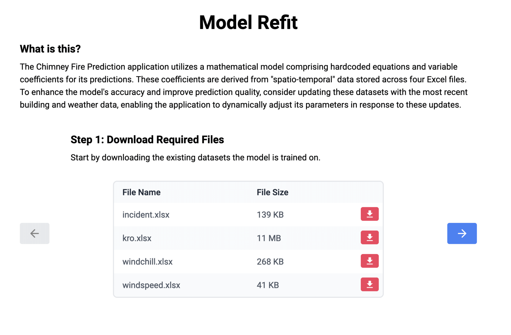

# Chimney Fire Risk Prediction Application

## Overview

This project presents a **data-driven application** designed to predict chimney fire risks in the Twente region. Leveraging the methodologies from [Lu et al.](https://projecteuclid.org/journals/annals-of-applied-statistics/volume-17/issue-4/Data-driven-chimney-fire-risk-prediction-using-machine-learning-and/10.1214/23-AOAS1752.short), the application utilizes **spatio-temporal modeling** to assess fire risks based on variables such as building characteristics and weather conditions.

## Key Features

- **Risk Assessment**: Evaluates chimney fire risk across different regions and timeframes.
- **Weather Data Integration**: Incorporates real-time weather forecasts to enhance prediction accuracy.
- **Uncertainty Quantification**: Provides confidence intervals alongside risk predictions.
- **Interactive Visualization**: Offers an interactive map interface for visualizing risk assessments.
- **Model Refitting**: Allows users to update model coefficients based on the latest incident, building and weather data.

## Technology Stack

- **Backend**: Node.js with Express, R for statistical computations, Docker for containerization.
- **Frontend**: React with Leaflet for mapping, Tanstack Query for data fetching, Tailwind CSS for styling.
- **Deployment**: Hosted on Microsoft Azure using Docker containers for integration with the BI tools of Twente Fire Brigade.

## Screenshots

### Prediction Map View

_Displays predicted chimney fire risks across different regions in the Twente area._

## Model Refitting Interface

<table>
  <tr>
    <td></td>
    <td></td>
  </tr>
  <tr>
    <td></td>
    <td></td>
  </tr>
</table>

## License

This project is proprietary and is protected under copyright.
